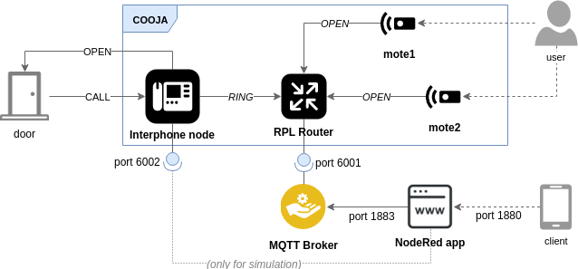
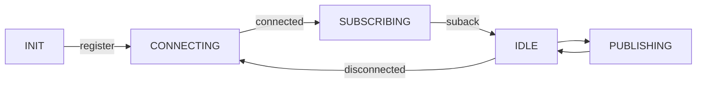
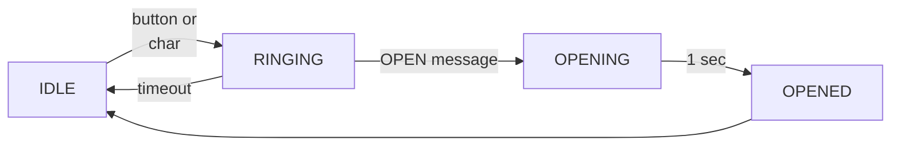
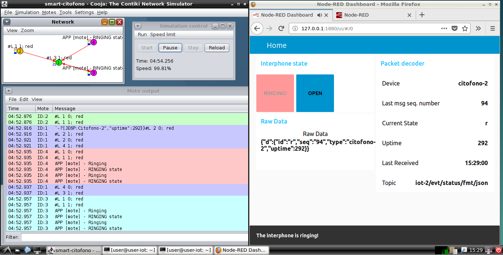

# Smart Citofono

## 1. General Concept

The project's goal is to design and develop a smart interphone system. This system is meant to be attached to an existing interphone and enables the user to receive calls and open the gate using custom remote devices and an HTTP page.

## 2. Design

The general design deals with two different types of nodes: an *interphone* node and (possibly many) *mote* nodes. This nodes are part of the same network and communicate using MQTT. For this reason, a RPL border router and a MQTT broker have to be deployed in the system. In particular, the RPL border router for this project is provided by Contiki and the chosen MQTT broker is *Mosquitto*.

Finally, the system also includes a NodeRed application, which can receive and send MQTT messages on the same broker. Here is a diagram of the realized system:

### 2.1 Contiki OS

It has been chosen to implement the physical nodes (interphone and motes) using Contiki OS, which gives the possibility to simulate the entire network on Cooja running the real firmware, and has an already built-in library to handle MQTT.

The downside of Contiki is that not many embedded devices are supported. For this reason, it is likely that this solution will not be adopted in the final implementation.

### 2.2 MQTT Layer

The MQTT engine, provided by Contiki, gives a simple way to perform *publish*, *subscribe*, *connect* and *disconnect* actions and receive MQTT messages, but does not provide a complete implementation. This has been implemented with a State Machine that keeps the state of the MQTT engine and handles the internal transitions. The implementation can be found in the `src/common.c` and `src/common.h` files, which are part of both the interphone's and the mote's firmware. Here's a simplified state machine diagram:

Both the motes and the interphone publish JSON messages with the following fields:

- *id*: a char defining the current state of the device, as defined in `src/protocol.h`
- *seq*: sequence number of the message, calculated by the sender
- *type*: sender's device type, e.g. interphone or mote, followed by the last 4 hex digits of the node's IPv6 address
- *uptime*: time from device startup, in seconds

The MQTT channel is used with QOS 0.

### 2.3 Interphone node

The interphone node subscribes to `iot-2/cmd/+/fmt/json` and continuously publishes its state on the `iot-2/evt/status/fmt/json` topic. The interphone RINGING state can be triggered either by a button press or by receiving a char on the serial line. If an OPEN message is received within a time window, the interphone opens the gate, otherwise it will return to IDLE immediately. Here's the corresponding state machine diagram, which is implemented in `src/citofono.c`:

### 2.4 Motes

The mote nodes subscribes to the `iot-2/evt/status/fmt/json` topic waiting for the interphone to signal a RINGING state: when this happens, the mote itself starts ringing (lights up a LED in the simulation) and can send the OPEN message if its button is pressed. Pressing the button when the interphone state is not RINGING will have no effect.

The mote's state machine and settings can be found in `src/mote.c`.

### 2.5 NodeRed Dashboard

The NodeRed dashboard has 3 main functions:

* *Log* all the traffic coming from the MQTT channels. The log file path can be decided from the UI. Also, the UI displays the decoded messages in real-time to the user.
* Work as a *remote controller*, which can issue an OPEN message when the corresponding button is pressed. The user is notified when the interphone is ringing and the current state of the interphone is visible on the UI.
* *Simulate* an interphone call, forcing the interphone node to ring (i.e. sending a character on the interphone's simulated serial line).

## 3. Simulation

The Cooja simulation is provided in the `smart-citofono.csc` file. It needs Mosquitto and `tunslip6` running: see the `README.md` file. It consists of 4 components: an RPL border router (ID: 1) taken from `contiki/examples/ipv6/rpl-border-router/`, an interphone node (ID: 2) and two mote nodes (ID: 3 and 4). 

The interphone's LEDs are used as actuators, in particular the blue LED indicates a ringing state and the green LED simulates the gate actuator. The mote's blue LED also represents the ringing state. Moreover, the button sensor of the interphone is used to represent the hardware signal corresponding to an interphone call. The red LED signals the error state of the MQTT state machine in both types of nodes.

The Cooja simulation exposes 2 ports: `6001` corresponds to the router's serial port, `6002` is forwarded to the interphone node's serial port. In this way, the Mosquitto broker running on localhost can be connected to the network through `tunslip6` on `6001`, while the NodeRed application can force a call by sending a character on the `6002` port.

The log file `log.txt` contains a complete log of this simulation: after connecting all nodes, the interphone's button has been pressed, causing the interphone to ring, and after a while one of the mote's button has been pressed, causing an OPEN message. Log lines preceded by MQTT are specific of the MQTT engine, while those preceded by APP are generated by the application (MQTT state machine and higher level).

## 4. Implementation

For the hardware implementation, a solution with some ESP32 module connected with a RPi via WiFi has been taken into consideration, as it is cheaper and more flexible. This part is still work in progress. Enhanced security features, even if strongly needed in a real world system, are beyond the scope of this project and are not taken into consideration.